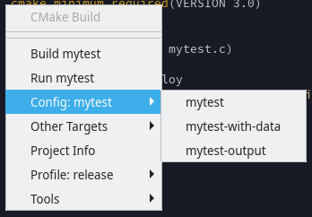
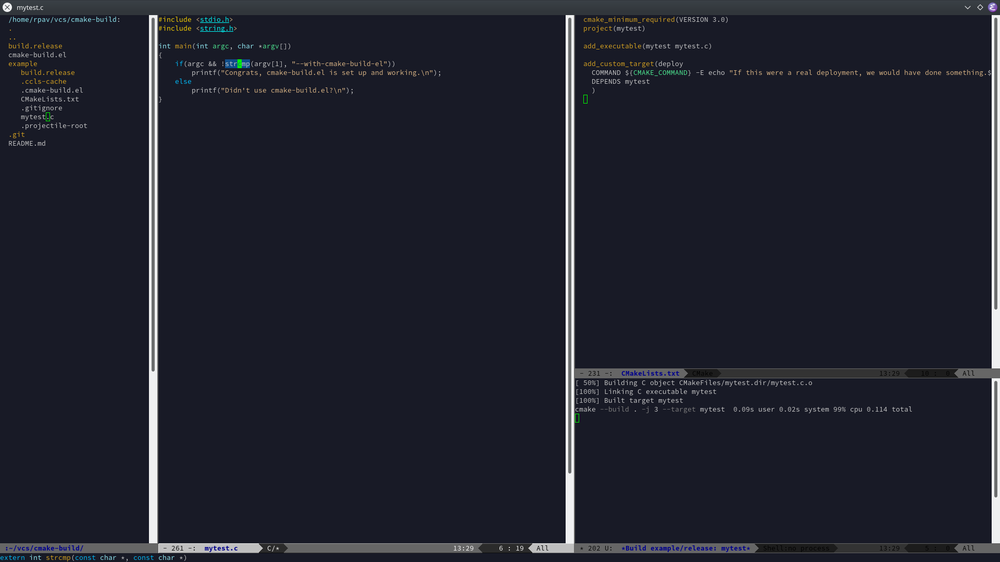

# cmake-build.el

This is an emacs extension for building projects using cmake.  It uses
[projectile](https://github.com/bbatsov/projectile) for a few basic features.
Main features:

* Support for multiple build profiles/directories
* Support for multiple targets
* Support for multiple run configurations
* Quick commands for doing various things (compile, run, cmake clean, etc)
* Graphical menu for selecting profiles, configurations, etc
* Calls `cmake` rather than relying on specific build systems, so anything
  should work (e.g., GNU `make`, `ninja`, etc)

Menu:



Build window:



## Why

Basically, see the feature list.  Projectile has some basic support for "build"
but no comprehension of more complex project builds.  I almost always have
numerous build configurations with multiple compilers (clang, gcc for each of
`Release`, `Debug`, etc.).  My projects often have numerous targets and
sometimes multiple configurations I switch between regularly... for instance, a
viewer might be configured to run with multiple different test files.

## Basic Setup

This comes with a very tiny example project, in `example/`.  You should be able
to load `mytest.c` and use the commands, hotkeys (if you bind them), or menu
(likewise) to invoke cmake-build and compile/run.

### Projectile

First, need a project root.  This uses projectile.

I **highly** recommend creating the file `.projectile-root` in the root of your
project, and using the following configuration:

```lisp
(setq projectile-project-root-files-top-down-recurring
  '(".projectile-root"))
(setq projectile-project-root-files-bottom-up nil)
```

This causes projectile to base the root directory off one thing: the existence
of the file `.projectile-root`.

### cmake-build.el

Next, you need a `.cmake-build.el` in the project root.  This describes a
number of things:

* Options to pass to cmake
* How to configure each of your build directories
* Additional targets you want to consider (clean is builtin)
* Run configurations: a target to build, and a binary to run, where to run it,
  and with what options.

For example, suppose we have a simple setup that builds `mytest`.  We might set
up the following `.cmake-build.el`:

```lisp
((cmake-build-cmake-profiles
  (release "-DCMAKE_BUILD_TYPE=Release")
  (debug "-DCMAKE_BUILD_TYPE=Debug"))

 (cmake-build-run-configs
  (mytest
   (:build "mytest")
   (:run "" "./mytest" ""))))
```

First, you should do `M-x cmake-build-set-cmake-profile`, and type or select
the profile you want (`release` or `debug`).

Now you can run `M-x cmake-build-clear-cache-and-configure`.  Since this is a
mouthful to type (fingerful?), I generally bind it to `C-S-F7`.  This will
create `build.release` (or `build.debug` if you selected that), if it doesn't
exist, remove the cmake cache, and run cmake with your configuration.

If you don't want to fully reconfigure, `M-x cmake-build-run-cmake`, which I
bind to `S-F7`, will just run cmake with the current profile.  This requires
the directory etc exist.

**Note:** *Unlike* emacs's "project-local variables," *nothing* is evaluated
from `.cmake-build.el`.  This is `READ` only (in the lisp sense).  Emacs's
reader does not appear to allow arbitrary evaulation during read (e.g. Common
Lisp's `#.(form)`).

## Usage

### Building and Running

Before you build, you need to select a target.  Target management is done
through run configurations, as set up above.  `cmake-build.el` does not parse
your CMakeLists.txt.

* Pick your run configuration using `M-x cmake-build-set-config`
* (Optional) Build using `M-x cmake-build-current`
* Run using `M-x cmake-build-run`

I bind build to `F7` and run to `F5`.  By default, with
`cmake-build-before-run` set to `t`, running will first invoke build, so if you
want to run you can skip the build step.

Either of these commands will open a small shell process window below the
current one (size configurable via `cmake-build-run-window-size`) showing the
output.

### Graphical Menu

Most of the commands are available via the graphical menu.  This is available
by using `M-x cmake-build-menu`, which I bind to `C-c b`.  This will let you
graphically select profiles, run configurations, other targets, and a few basic
"tools" (such as the `clean` target).

### Debugging

A simple option has been added to call the emacs `M-x gdb` with the current target and default/basic options.  One can run this by `M-x cmake-build-debug` or via the cmake-build menu.

There are no options for this right now; perhaps in the future.

## Extended Configuration

### Run configurations

Run configurations pair a target and a command invocation.  Target
configuration is straightforward enough:

```lisp
(:build "targetname")
```

Where, of course, `"targetname"` should correspond to a target cmake
understands.

Run configurations are slightly more complex:

```lisp
(:run "path" "command" "parameters")
```

The `"path"` parameter will be the current working directory.  This should be
relative to the *build* root.  (Mechanically, it will be bound to
`default-directory` during the invocation, i.e., it is the actual cwd, and not
prepended to the command).

The `"command"` parameter is what is passed to the shell, along with
`"parameters"`.  For instance, we could have multiple configurations for
`mytest`:

```
(( .. )

 (cmake-build-run-configs
  (mytest
   (:build "mytest")
   (:run "" "./mytest" ""))
  (mytest-with-data
   (:build "mytest")
   (:run "" "./mytest" "data.txt"))
  (mytest-output
   (:build "mytest")
   (:run "" "./mytest" "data.txt -o output.txt"))
  : .. and so on ..
  )
```

Additionally, one can specify `(:env ...)` to set various environment variables:

```
  (mytest
   (:build "mytest")
   (:run "" "./mytest" "")
   (:env "LSAN_OPTIONS=suppressions=..." "SOMEVAR=...")
```

This applies only while running (or debugging).

### Other targets

It is often useful to build "other" targets with cmake; for instance, you may
create a target with cmake's `add_custom_target(TARGET-NAME ..)`.  You can
specify this in `.cmake-build.el`:

```
;;; Order doesn't matter here; context for illustration

((cmake-build-cmake-profiles ...)
 :
 (cmake-build-other-targets "some-target" "another-target" ...)

 : etc
 )
```

This will populate the "Other targets" menu.


### Projectile modeline

If you want to show the current run configuration in the modeline, you could use projectile's modeline function:

```elisp
(defun projectile-custom-mode-line-function ()
  (if-let ((name (cmake-build-get-run-config-name)))
      (format "[%s:%s]"
              (projectile-project-name)
              (cmake-build-get-run-config-name))
    (projectile-default-mode-line)))

(setq projectile-mode-line-function 'projectile-custom-mode-line-function)
```

The critical call here is `(cmake-build-get-run-config-name)`.

### Out-of-tree builds

You may wish to build in another location.  By default, builds happen in a profile-specific build directory in the root of the project.  You may set a new root for builds by using `M-x cmake-build-set-project-build-root` and specifying a path.  This is also available under the "Tools" menu with "Set project build root".

### Alternate build directory name format

By default, the build directory is named in the form `build.<profile>`.  For instance, if your profile is `gcc-debug`, the build directory is `build.gcc-debug`.

If you wish to alter this, you may write a new elisp function in the following form:

```elisp
;;; This will make the build directory "gcc-debug.build" instead
(defun my-dir-name-function (project-root profile)
  (concat profile ".build"))
```

Note that this should be a single filename without `/` or other path.  The project root is given for convenience in case one wishes to do anything interesting based on the source (e.g., look up a VCS tag or revision).

### Custom variables

A number of variables are available for customization:

* `cmake-build-local-options-file`: This is the file where "local" options are
  stored in your `~/.emacs.d/`.
* `cmake-build-run-window-autoswitch`: (Default: set)  If set, this will
  automatically switch between compile and run output.
* `cmake-build-before-run`: (Default: set)  If set, this will try to build
  before running.  If build fails, it will not run.
* `cmake-build-run-window-size`: (Default: 20)  This is the size in lines of
  the split build/run windows.

### Local settings

A number of local settings are stored by default in your
`~/.emacs.d/cmake-build-options.el`.  These are separate from custom variables
(which are stored in whatever `custom` file you've configured).  This is to
support "shared" custom variables (i.e., you check them into a repository), but
"local" cmake-build.el settings.  You can exclude this file from VCS, and not
have a dirty tree everytime you switch configurations and profiles.

Note this file is similar to `custom` data and is not intended to be directly edited.  It is likely to be overwritten if you make changes.

The variables are as follows:

* `cmake-build-profile`: The current profile
* `cmake-build-options`: Additional options passed to `cmake`, e.g. `-j 4`.
  You can set this via the menu or `M-x cmake-build-set-options`.
* `cmake-build-run-config`: The current run configuration.
* `cmake-build-project-root`: This, if set, will force a project root, ignoring
  projectile.  This may be useful if you're working in multiple directories but
  only want to build in one specific root.  You can set this by `M-x
  cmake-build-set-project-root`.  Note, this does *not* override *projectile
  itself*, just cmake-build.el.
